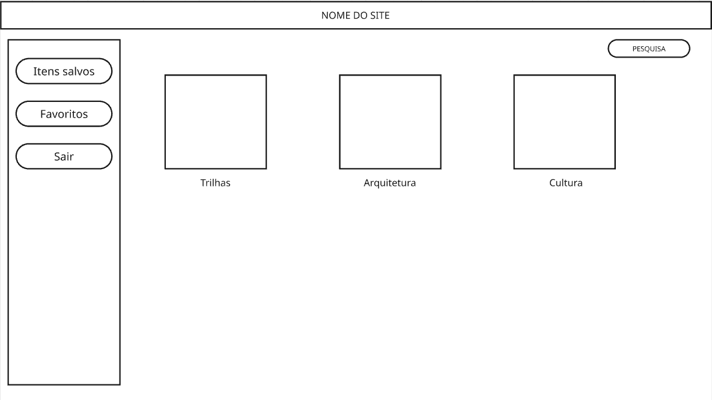
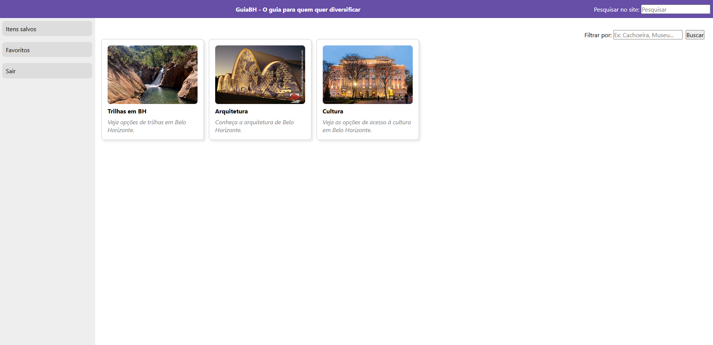

Dados básicos:
NOME: João Paulo Miranda Cardoso
Matrícula: 936517
Proposta de projeto escolhida: 2
Breve descrição sobre o projeto: Site de guia de atrações em Belo Horizonte. Tanto para pessoas que moram na cidade e querem diversificar, quanto para quem está visitando a cidade e tem conhecimento sobre as atrações do local.
Imagem do esboço (wireframe) criado para o projeto:

Print da home-page criada para o projeto:

